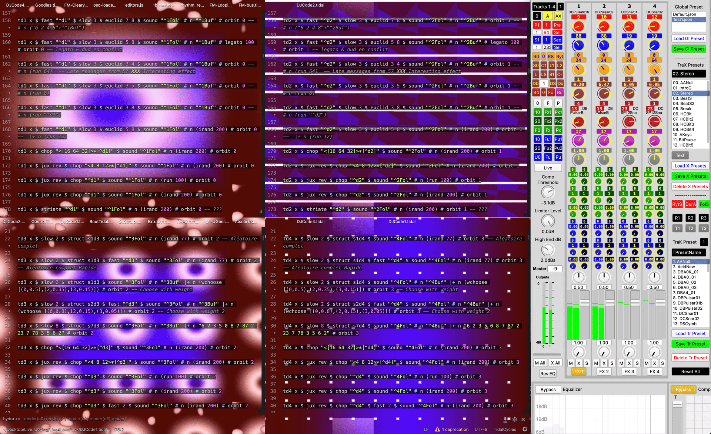

# Welcome to ***Live 4 Bubbles !*** &nbsp;&nbsp; <span class="badge-licence"><a href="https://creativecommons.org/licenses/by-nc-sa/4.0/" title="Licence"></a></span> &nbsp;&nbsp; <span class="badge-buymeacoffee"><a href="https://ko-fi.com/Live4Life" title="Donate to this project using Buy Me A Coffee"></a></span> &nbsp;&nbsp; <span class="badge-patreon"><a href="https://patreon.com/Live4Life" title="Donate to this project using Patreon"></a></span>

<p align="center">

</p>

<div align="center">

| [**Overview**](#-overview) | [**Installation**](#-installation) | [**Setup**](#%EF%B8%8F-setup) | [**Documentation**](#-Documentation) | [**References**](#-references) | [**Contribute**](#-contribute) | [**Acknowledgements**](#-acknowledgements) | [**Licence**](#-licence) |

</div>

---

# 📖 Overview

---

## 🎯 What is Live 4 Bubbles?

**A performance tool for controlling Live Coding Databases from [Tidal Cycles](https://tidalcycles.org/) and [Hydra](https://hydra.ojack.xyz/) with [SuperCollider](https://supercollider.github.io/) GUI and controllers.**

*This is my new life-long project, for as many years as possible until the end of my life.*

## 🚀 Vision

*Live 4 Bubbles* is partly an extension and modified version based on [SuperDirtMixer](https://github.com/thgrund/SuperDirtMixer) from Thomas Grund. But it goes **far beyond** a mixer for Tidal Cycles.

It transforms your live coding setup into a **comprehensive performance and control system** with control over your rhythmic, spectral and spatial patterns of sound files and SuperCollider synthesis in real-time.

⚠️ *Live 4 Bubbles* is a comprehensive performance system for live coding that leverages all available open-source online resources, pushing the boundaries of digital creation. While the program can be launched quickly once installed, the installation process involves setting up numerous dependencies and programs to maximize control possibilities over sound synthesis and pattern manipulation.

## 🎛️ Core Features

### 🎚️ Multi-Track Control System

Control code execution dynamically across up to **8 independent tracks** with dozens of parameters:
- 🎯 Trigger and control Tidal Cycles code lines from SuperCollider GUI,
- 🔄 Switch between different code patterns on the fly,
- 💾 Preset system for instant performance setup and transitions with crossfade,
- 🎮 Integration with MIDI controllers for hands-on control.

*(The images above represent a four-track configuration)*

### 🎼 Parameter Management

Complete control over every aspect of your performance:
- ⏱️ **Timing** - Speed, duration, and legato control,
- 📁 **Sound Selection** - Quick navigation through sound libraries with folder and buffer selection,
- 🎨 **Effects Database** - Filter and apply effects to both sound and patterns with multiple parameter controls,
- 🌐 **Spatial Control** - Positioning and orbit management for immersive soundscapes.

---

# 💿 Installation

---

## 📋 Prerequisites

Before installing *Live 4 Bubbles*, ensure you have the following installed:

- **[SuperCollider](https://supercollider.github.io/)** - Audio synthesis platform,
- **[Tidal Cycles](https://tidalcycles.org/)** - Live coding pattern language,
- **[SuperDirt Quark](https://github.com/musikinformatik/SuperDirt)** - SuperCollider synthesizer for Tidal,
- **[Pulsar](https://pulsar-edit.dev/)** - Text editor for live coding,
- **[pulsar-tidalcycles](https://web.pulsar-edit.dev/packages/tidalcycles)** - Pulsar package for Tidal Cycles integration.

💡 **Tip:** You can use my variation of [pulsar-tidalcycles](https://github.com/Xon77/pulsar-tidalcycles) for the additional feature of selecting lines from different tabs **and** different splits.

✨ **Recommended:** Install the [SuperCollider sc3-plugins](https://supercollider.github.io/sc3-plugins/#installation) for extended synthesis capabilities.

## 📥 Step-by-Step Installation

### 1️⃣ Install SuperDirtMixer

*Live 4 Bubbles* is built on top of SuperDirtMixer. Follow the instructions in [SuperDirtMixer](https://github.com/thgrund/SuperDirtMixer) to install all [its requirements](https://github.com/thgrund/SuperDirtMixer?tab=readme-ov-file#requirements).

### 2️⃣ Download *Live 4 Bubbles*

Clone or download the *Live 4 Bubbles* repository to your local machine:

```bash
git clone https://github.com/Xon77/Live4Bubbles.git
```

### 3️⃣ Install SuperCollider Quarks for MIDI Controllers

If you plan to use MIDI controllers, install the required Quarks in SuperCollider:

#### 🎛️ For MIDI Fighter Twister:
- Install the `MidiFighterTwister` Quark,
- Install the `Connection` Quark.

#### 🎚️ For Xone K2 or K3:
- Install the `Modality-toolkit` Quark,
- Copy the [`xoneK2.desc.scd`](L4B_SC/xoneK2.desc.scd) file into the `MKtlDescriptions` folder within the Modality Quark directory:
  - **macOS**: `~/Library/Application Support/SuperCollider/downloaded-quarks/Modality-toolkit/Modality/MKtlDescriptions/`,
  - **Linux**: `~/.local/share/SuperCollider/downloaded-quarks/Modality-toolkit/Modality/MKtlDescriptions/`,
  - **Windows**: `%USERPROFILE%\AppData\Local\SuperCollider\downloaded-quarks\Modality-toolkit\Modality\MKtlDescriptions\`.

#### 💻 To install Quarks:

Open SuperCollider and run:
```supercollider
Quarks.install("MidiFighterTwister");
Quarks.install("Connection");
Quarks.install("Modality-toolkit");
```

### 4️⃣ Install *Live 4 Bubbles* in SuperCollider Extensions

Copy the [`L4B_SC/SuperDirtMixerX/`](L4B_SC/SuperDirtMixerX/) folder into your SuperCollider extensions folder:

- **macOS**: `~/Library/Application Support/SuperCollider/Extensions/`,
- **Linux**: `~/.local/share/SuperCollider/Extensions/`,
- **Windows**: `%USERPROFILE%\AppData\Local\SuperCollider\Extensions\`.

### 5️⃣ Setup your Sound Database

⚠️ **Important**: Your sound folder must be structured following the [Live 4 Life sound database structure](https://github.com/Xon77/L4LSoundsDataBase/tree/main/SoundFolder), except that folder names should use underscores instead of spaces (e.g., `DB_MBass` instead of `DB MBass`).

Example structure:
```
YourSoundFolder/
├── DB_Kick/
│   ├── sound1.wav
│   └── sound2.wav
├── DB_Snare/
├── DB_Bass/
└── ...
```

### 6️⃣ Configure File Paths in SuperCollider

Edit the initialization files in [`L4B_SC/L4B_SC_Project/`](L4B_SC/L4B_SC_Project/) to match your system paths:
- Open [`_0T_Init_TidalX.scd`](L4B_SC/L4B_SC_Project/_0T_Init_TidalX.scd) in SuperCollider,
- Update the sound folder path to point to your sound database,
- Update any other paths as needed for your setup.

---

# ⚙️ Setup

---

## 🚀 Quick Start

### 1️⃣ Start SuperCollider

Open SuperCollider and evaluate the initialization file:
- Navigate to folder [`L4B_SC/L4B_SC_Project/`](L4B_SC/L4B_SC_Project/),
- Open file [`_0T_Init_TidalX.scd`](L4B_SC/L4B_SC_Project/_0T_Init_TidalX.scd),
- Evaluate the section in parentheses between [lines 16 and 422](L4B_SC/L4B_SC_Project/_0T_Init_TidalX.scd#L16-L422) within the file (Cmd+Enter on macOS, Ctrl+Enter on Windows/Linux).

**This will:**
- 🔊 Boot the SuperCollider server,
- 📦 Load SuperDirt and *Live 4 Bubbles*,
- 🖥️ Initialize the GUI,
- 🎹 Setup all MIDI connections (if configured).

### 2️⃣ Launch Pulsar with Tidal Files

Create a four-track code execution partition by opening all Tidal Cycles files from the [`L4B_Tidal/`](L4B_Tidal/) folder in Pulsar:

1. [`L4B_Tidal/DJCode1.tidal`](L4B_Tidal/DJCode1.tidal) in tab 1,
2. [`L4B_Tidal/DJCode2.tidal`](L4B_Tidal/DJCode2.tidal) in tab 2,
3. [`L4B_Tidal/DJCode3.tidal`](L4B_Tidal/DJCode3.tidal) in tab 3,
4. [`L4B_Tidal/DJCode4.tidal`](L4B_Tidal/DJCode4.tidal) in tab 4,
5. [`L4B_Tidal/DJCodeG.tidal`](L4B_Tidal/DJCodeG.tidal) in tab 5 (for global control),
6. [`L4B_Tidal/ControlTidal.tidal`](L4B_Tidal/ControlTidal.tidal) in tab 6 (for initialization).

💡 **Tip:** Other workflows are possible. For example, you can execute code lines by selecting different splits and tabs. *(The images above represent four splits of the first tab.)*

### 3️⃣ Initialize Control Variables in Tidal Files

In [`ControlTidal.tidal`](L4B_Tidal/ControlTidal.tidal), evaluate the following sections in order with Ctrl+Enter (Cmd+Enter on macOS):

1. **[Lines 5 to 1107](L4B_Tidal/ControlTidal.tidal#L5-L1107)** - Main control definitions and functions,
2. **[Line 1110](L4B_Tidal/ControlTidal.tidal#L1110)** - Initialization of controls and variables,
3. **[Line 1113](L4B_Tidal/ControlTidal.tidal#L1113)** - Update of definitions and functions of step 1,
4. **[Lines 1118 to 1136](L4B_Tidal/ControlTidal.tidal#L1118-L1136)** - Final initialization for crossfades.

This sets up all control parameters for tempo, duration, sound folders, buffers, effects, and more.

🎉 **You can begin to play!**

## 🎹 MIDI Controller Setup

*Live 4 Bubbles* supports multiple MIDI controllers for hands-on control.

### 🎛️ Supported Controllers

The mapping has been done for the following controllers:

- 🎚️ **[Xone K2 or K3](https://www.allen-heath.com/hardware/xone-series/xonek3/)** from Allen & Heath
  [`_Init Midi X2.scd`](L4B_SC/L4B_SC_Project/_Init%20Midi%20X2.scd)

- 🎛️ **[MIDI Fighter Twister](https://www.midifighter.com/#Twister)**
  [`_Init Midi T2.scd`](L4B_SC/L4B_SC_Project/_Init%20Midi%20T2.scd)
  💡 **Tip:** You can connect up to 3 MIDI Fighters together. Name them: "MIDI Fighter Twister 1", "MIDI Fighter Twister 2", "MIDI Fighter Twister 3".

- 🎹 **[Launchpad X](https://novationmusic.com/products/launchpad-x)** from Novation
  [`_Init Midi LPX.scd`](L4B_SC/L4B_SC_Project/_Init%20Midi%20LPX.scd)

### 🔌 Setup Process

Simply connect your MIDI controller. The controllers are automatically initialized when evaluating [`_0T_Init_TidalX.scd`](L4B_SC/L4B_SC_Project/_0T_Init_TidalX.scd).

## 🎨 Pulsar Styling (Optional)

For a customized Pulsar appearance optimized for *Live 4 Bubbles*:

1. Navigate to folder [`L4B_Pulsar/`](L4B_Pulsar/),
2. Copy the styles from [`styles.less`](L4B_Pulsar/styles.less),
3. Paste them into your Pulsar stylesheet (Edit → Stylesheet).

---

# 📖 Documentation

---

## 🎛️ Control Parameters

Each of the **8 tracks** has access to the following parameters:

### ⏱️ Timing & Structure
- `d1` to `d8` - Tempo (speed control),
- `1Leg` to `8Leg` - Duration (pattern length),
- `1LegS` to `8LegS` - Duration algorithm switch.

### 📁 Sound Selection
- `1Fol` to `8Fol` - Buffer Folder (directory containing audio samples),
- `1Buf` to `8Buf` - Sound file (within the Buffer Folder),
- `1FolN` to `8FolN` - Normalized folder index (0-1),
- `1BufN` to `8BufN` - Normalized buffer index (0-1).

### ▶️ Playback
- `1Rat` to `8Rat` - Playback rate/speed,
- `1Ran` to `8Ran` - Random parameter (context-dependent - filter by default),
- `1Xon` to `8Xon` - Orbit assignment.

### 🎨 Sound Effects (2 chains per track)

**Chain 1:**
- `1fxs` to `8fxs` - **When** (timing algorithm type),
- `1fxx` to `8fxx` - **How** (superposition or not, including delay),
- `1fxt` to `8fxt` - **When value** (value of the When algo),
- `1fxp` to `8fxp` - **What** (specific effect transformation),
- `1fxv` to `8fxv` - **How much or What value** (value of the What algo).

**Chain 2:**
- `1fxs2` to `8fxs2` - **When** (timing algorithm type),
- `1fxx2` to `8fxx2` - **How** (superposition or not, including delay),
- `1fxt2` to `8fxt2` - **When value** (value of the When algo),
- `1fxp2` to `8fxp2` - **What** (specific effect transformation),
- `1fxv2` to `8fxv2` - **How much or What value** (value of the What algo).

### 🔄 Pattern Functions (2 chains per track)

**Chain 1:**
- `1fus` to `8fus` - **When** (timing algorithm type),
- `1fux` to `8fux` - **How** (superposition or not, including delay),
- `1fut` to `8fut` - **When value** (value of the When algo),
- `1fup` to `8fup` - **What** (transformations: degradeBy, trunc, etc.),
- `1fuv` to `8fuv` - **How much or What value** (value of the What algo).

**Chain 2:**
- `1fus2` to `8fus2` - **When** (timing algorithm type),
- `1fux2` to `8fux2` - **How** (superposition or not, including delay),
- `1fut2` to `8fut2` - **When value** (value of the When algo),
- `1fup2` to `8fup2` - **What** (transformations: degradeBy, trunc, etc.),
- `1fuv2` to `8fuv2` - **How much or What value** (value of the What algo).

### 🌐 Spatial
- `1Spa` to `8Spa` - Spatial positioning.

---

📚 **See the [wiki](https://github.com/Xon77/Live4Bubbles/wiki) for more details** (under construction and constant updates).

📝 **Additional documentation will be added in the coming weeks and months.**

---

# 📚 References

---

This project, briefly introduced during **Composite Montréal** in June 2025 through a 5-minute pitch, has been presented on **Saturday, October 18, 2025** as part of a three-hour public experimental workshop at [Eastern Bloc](https://www.easternbloc.ca), which included a short performance and a participatory exploration session with the audience. I warmly thank [Eastern Bloc](https://www.easternbloc.ca) and [CALQ](https://www.calq.gouv.qc.ca/en/) for their support in making this presentation possible.

---

# 🤝 Contribute &nbsp;&nbsp; [](https://ko-fi.com/Live4Life) &nbsp;&nbsp; <a href="https://www.patreon.com/Live4Life"></a>

---

**Want to contribute?** Please get in touch with me to organize further development.

**Support this project through donations via [Ko-fi](https://ko-fi.com/live4life) (one-time) or [Patreon](https://www.patreon.com/live4life) (ongoing support and courses).**

---

# 🙏 Acknowledgements

---

As [mentioned in my previous project](https://github.com/Xon77/Live4Life?tab=readme-ov-file#acknowledgements) ***Live 4 Life***, I would have been unable to build this tool without the help of the **SuperCollider online and live coding community**, who always answered my questions and even provided me with examples of codes and classes.

### 🌟 Special Thanks

**Thomas Grund** - Without whom this project would not have come to life:
- 🎛️ For creating the [SuperDirtMixer](https://github.com/thgrund/SuperDirtMixer) Quark,
- 💡 For implementing the feature allowing the evaluation of Tidal code lines in Atom/Pulsar, which I had suggested on [GitHub](https://github.com/tidalcycles/pulsar-tidalcycles/issues/119).

---

This project was supported by the [**Conseil des arts et des lettres du Québec (CALQ)**](https://www.calq.gouv.qc.ca/en/).

<p align="center">
<a href="https://www.calq.gouv.qc.ca/en/">

</a>
</p>

---

# 📄 Licence

---

© 2025 - End of the world ∞ **Christophe Lengelé**

***Live 4 Bubbles*** is open source software: you can redistribute it and/or modify it under the terms of the **Creative Commons Attribution-NonCommercial-ShareAlike 4.0 International license** (CC BY-NC-SA 4.0).

### ⚠️ Usage Restrictions

**Commercial Use:** You may not use this tool for commercial purposes.

**Free Party Spirit:** I wish it would be used in the spirit of [*Free Party*](https://en.wikipedia.org/wiki/Free_party). Unfortunately, *Free* does not mean free in this commercial world, but invites to contribute to the costs and labor according to one's ability to give. **I do not want this tool to be used, by any means, for personal profit.**

**Specific Restriction:** I do not want this tool to be used by or in [Société des Arts Technologiques](https://sat.qc.ca) without my consent, since this organization never helped me in diffusing my spatial creations in their dome despite my previous proposals. *(This restriction will be withdrawn only if I have the opportunity to play improvisations in their dome with an appropriate allowance. However, it will surely never happen, since I am no longer interested in sending them applications and I am looking for more open spaces. But, life is unpredictable.)*

### 📋 Disclaimer

This program is distributed in the hope that it will be useful, but **WITHOUT ANY WARRANTY**.

---

See the [License](/LICENCE.md) for more details.